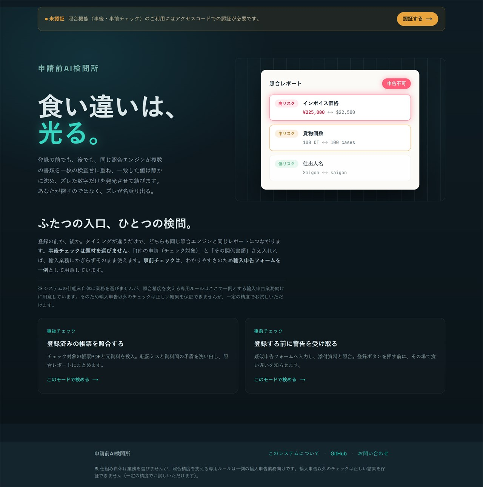
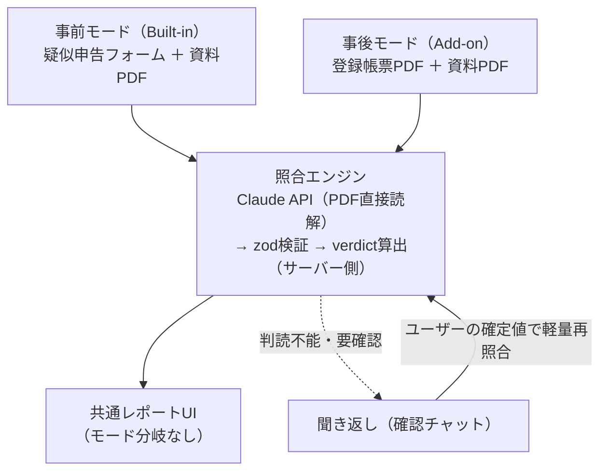
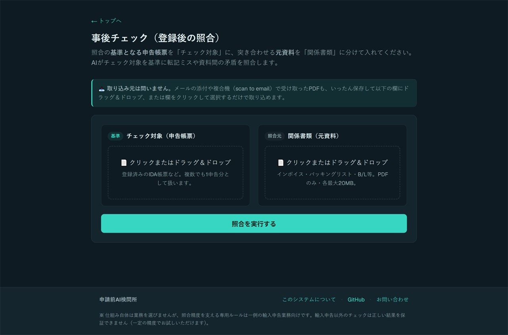
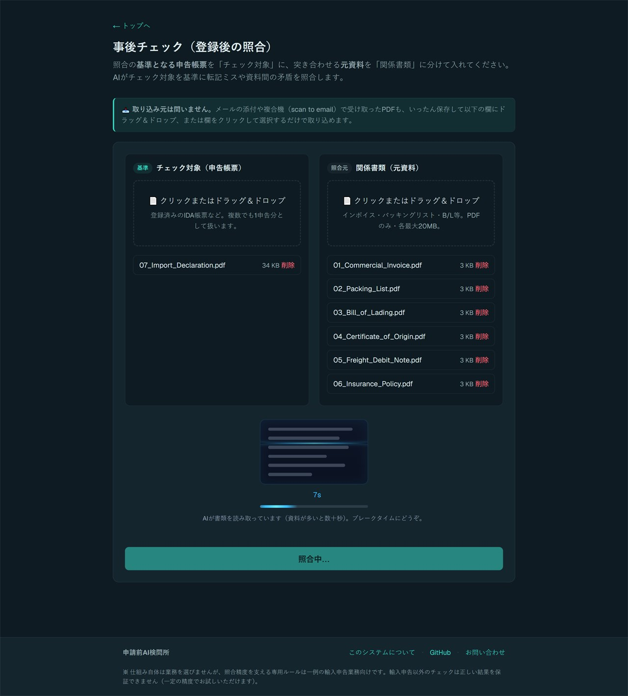
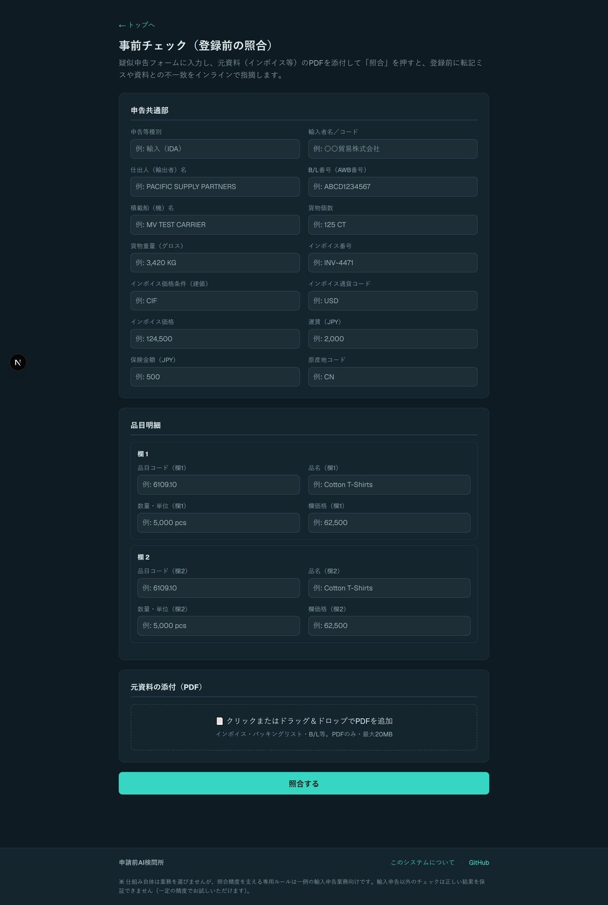
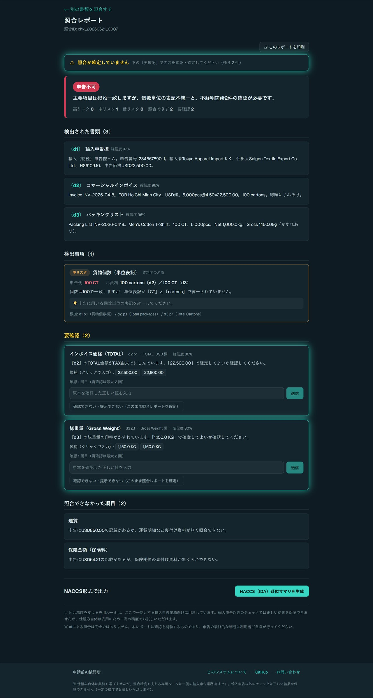
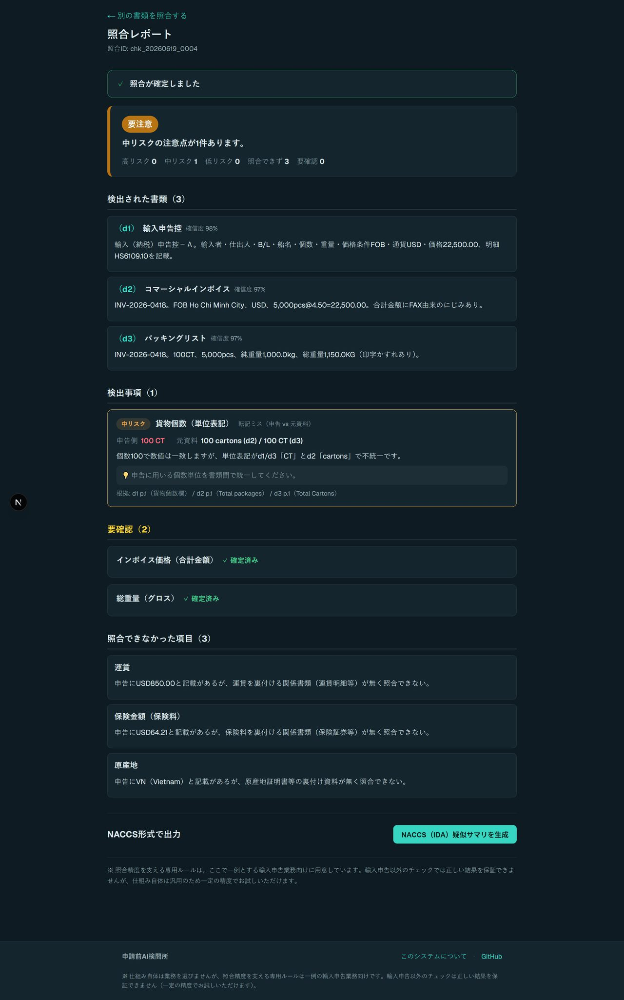
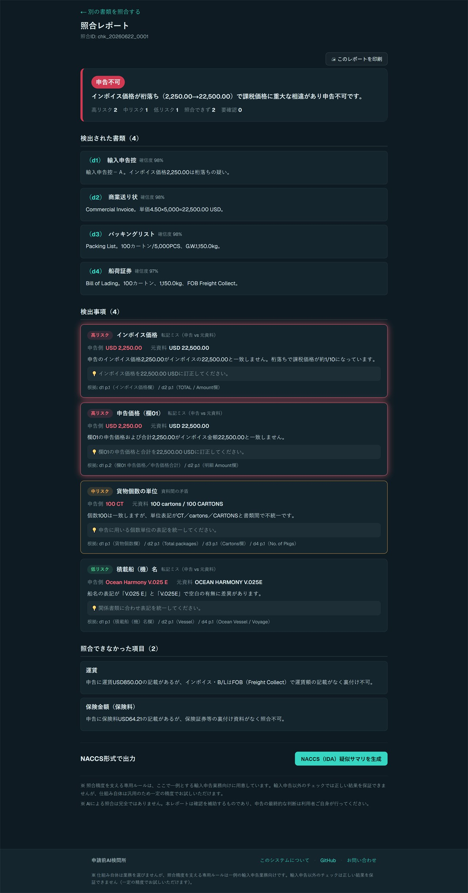
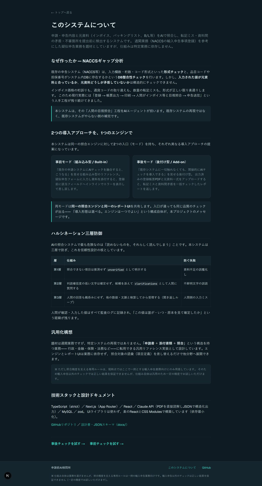

# 申請前AI検問所 — Pre-submission Validation Gateway

**30年の貿易実務で見てきた書類ミスの痛みを、AIエージェントで解消する。**

申請・申告の内容と元資料（インボイス、パッキングリスト、B/L等）をAIが照合し、転記ミス・資料間矛盾・不審箇所を提出前に検出するWebアプリケーションです。題材には通関業務（NACCSの輸入申告事項登録）を参考にした疑似申告業務を採用していますが、仕組みは特定業務に依存せず、申請書と添付書類を扱うあらゆる業務に展開できます。

## 開発の動機

既存の申告システム（NACCS等）は入力の形式やシステム内DBとの整合性をチェックします。しかし、**入力された値が元資料と合っているか**は構造的にチェックできません。インボイス価格の桁誤りも、通貨の取り違えも、形式が正しければ素通りします。だから現場には「登録内容を印刷して、ユーザーが元資料と目視で突き合わせる」工程が残り続けてきました。

本システムは、その「ユーザーの目視照合」をAIエージェントが担います。既存システムの再現ではなく、既存システムがやらない側の補完です。

## 2つの導入アプローチを1つのエンジンで

| モード | 想定する導入形態 |
|---|---|
| **事前モード（Built-in）** | 申請システムにAIチェックを融合するとこうなる、という組み込み型のリファレンス。フォーム入力＋資料添付で、登録前に該当フィールドへインラインエラーを表示 |
| **事後モード（Add-on）** | 既存システムに一切触れず、出力された帳票PDFと元資料から後付けでAIチェックを始められる、という非侵襲導入の証明 |

両モードは**同一の照合エンジンと同一のレポートUI**を共有します。導入形態は選べる、エンジンは一つでよい——この構成自体が本プロジェクトのメッセージです。

## ハルシネーション三層防御

AIの照合システムで最も危険なのは「読めないものを、それらしく読んでしまう」ことです。本システムは三層で防ぎます。

1. **unverified** — 資料が足りず照合できない項目は「問題なし」に混ぜず、照合できなかったと明示する
2. **clarifications（聞き返し機能）** — FAX由来の不鮮明な文字などは推測せず、該当箇所のテキストと候補を添えてユーザーに質問する
3. **検算ループ** — ユーザーの回答も鵜呑みにせず、他の数値・文脈と突き合わせて整合した時点で確定する。確定の経緯は監査ログに記録される

## 実証テスト

実在の書類を含む多様なパターンで照合を検証しています。種別が曖昧な書類、FAX由来の不鮮明な文字、差し替え・金額相違・品名相違・船名違いなどを仕込んだ「崩しケース」を投入し、誤検出・見逃しを洗い出しては修正と再テストを繰り返して検出精度を高めてきました。「読めないものを推測しない」設計と合わせ、実務に耐える挙動を重視しています。

## スクリーンショット

### 事後モード（Add-on）— 既存システムに触れず、帳票と資料からチェック

資料を添付する前 → 添付後に照合を実行：

### 事前モード（Built-in）— フォーム入力＋資料添付でその場チェック

> ※ フォームの項目は、NACCSの輸入申告（IDA）を参考に本デモ用へ疑似的に作成したサンプルです。実際の申告画面・項目とは内容が異なる点をご了承ください。

### 照合レポート

不鮮明な値は推測せず「聞き返しチャット」で確認します（照合未確定）：

ユーザーが原本を見て確定すると、照合済みになります：

高リスクの不一致があるときは「申告不可」を表示します：

### About

## 技術スタック

TypeScript（strict）/ Next.js 16（App Router）/ React 19 / Claude API（`claude-opus-4-8`、PDFをbase64で直接読解・JSON構造化出力）/ MySQL 8（mysql2・生SQL）/ zod / vitest

UIライブラリは使わず、素のReact＋CSS Modulesで構築しています（依存最小化方針）。

**本番デプロイ構成**: Vercel（ホスティング）／ Vercel Blob private（PDF原本を暗号化して保管）／ **TiDB Serverless**（MySQL互換のクラウドDB）／ proxy（Next.js 16・旧 middleware）による認証（企業様ごとのアクセスコード）

> 補足（DB）：開発はローカルの **MySQL 8（mysql2）**、本番は **TiDB Serverless（MySQL互換・無料枠）**。ローカルと本番の不整合を避けるため、両者を MySQL 互換で統一しています（トラブル防止）。動作状況によっては **PlanetScale** 等へ変更する可能性があります。

## セキュリティ設計

- APIキーはサーバーサイドのみ。クライアントに露出しない
- アップロードはMIME＋マジックバイト検証、原本はAES-256-GCMで暗号化保存しDBにはパスとSHA-256ハッシュのみ
- 全操作（アップロード／照合／閲覧／確定）の監査ログ（誰が・いつ・何を）
- SQLはすべてプレースホルダ（prepared statement）
- AIの役割は事実の検出まで。登録可否の判定（verdict）はサーバー側コードが算出し、最終判断はユーザーが行う
- 無料枠の使用量制限を守るため、認証（企業様ごとのアクセスコード）とレート制限（利用回数の上限）を設けています

## セットアップ

インストール不要。ブラウザで公開URLを開くだけです。

**▶ デモを開く： https://pre-submission-ai-gateway.vercel.app**

本サービスは**企業様向けの限定公開**で、照合機能の利用には発行されたアクセスコードが必要です（トップページ・About は誰でも閲覧できます）。

## ロードマップ

- [x] 設計（設計書v0.3 / 照合エンジンJSONスキーマv0.3 / ワイヤーフレーム5画面）
- [x] **Phase 1**: 照合エンジン＋事後モード
- [x] **Phase 1.5**: 不明瞭な文字・あやふやな書類の聞き返し機能（確認チャット）
- [x] **Phase 2**: 事前モード（フォーム入力→インラインエラー→登録ボタン制御）＋ About画面
- [ ] **Phase 3**: メールからの書類取り込み（届いた資料を転送するだけで照合へ）。**本項目の実装をもってロードマップ完了とする。**
  - ※ 複合機からの直接取り込みは、企業様ごとの機器設定やIT運用環境への依存が大きく、汎用的な機能として提供しづらいため、今回はあえて実装対象から外しています。スキャンした資料はお手元に保存のうえ、本アプリへ添付してご利用ください。
- [x] **Phase 4**: 精密照合の一例として輸入申告に限定し、他業務・他業界は汎用性をもって試せるよう調整（今後のアップデートで他業務の精密照合を増やす予定）。なお、他業界に関する資料の精密照合を実装する際は、対象業務の内容や申請項目を十分にヒアリングしたうえで設計する必要がある
- [x] **デザイン刷新**: 該当箇所が「光る」デザインになるよう、フォーマット等にこだわって統一
- [x] **動作確認**: 崩しテストによるエラー検証に加え、高難易度のあやふやな実書類でテストを実施。精度が最大に上がるまで修正と再テストを繰り返した。なお現時点でも完成形とは考えておらず、今後もテストを重ね、実際にお試しいただいた結果も踏まえて精度を高めていきます
- [x] **一般公開**: 企業様向けの限定公開デモを公開（Vercel 本番稼働・アクセスコード制）

## 設計ドキュメント

- [docs/設計書_v0.3.md](docs/設計書_v0.3.md) — システム設計の正本
- [docs/照合エンジン_JSONスキーマ設計_v0.3.md](docs/照合エンジン_JSONスキーマ設計_v0.3.md) — データ構造（CheckResult）の正本

## 作者

貿易・物流の実務に約30年従事。現在はAI×ドメイン知識を軸にITエンジニアへ転身中。

## お問い合わせ

本システムに関するご質問、デモのアクセスコード発行のご相談などは、以下までお気軽にご連絡ください。

📧 [jumpdevelop00@gmail.com](mailto:jumpdevelop00@gmail.com)

## ライセンス・利用規約

© 2026 Junichi Sugawara. All Rights Reserved.

本リポジトリに含まれるソースコード・設計ドキュメント・UI・照合ロジック等は、著作者に帰属する著作物です。著作者の事前の書面による許可なく、複製・改変・再配布・再現（部分的なものを含む）を禁止します。本リポジトリの公開およびデモは閲覧・評価を目的とした利用に限り、商用利用および第三者への提供はできません。詳細は [LICENSE](LICENSE) を参照してください。
